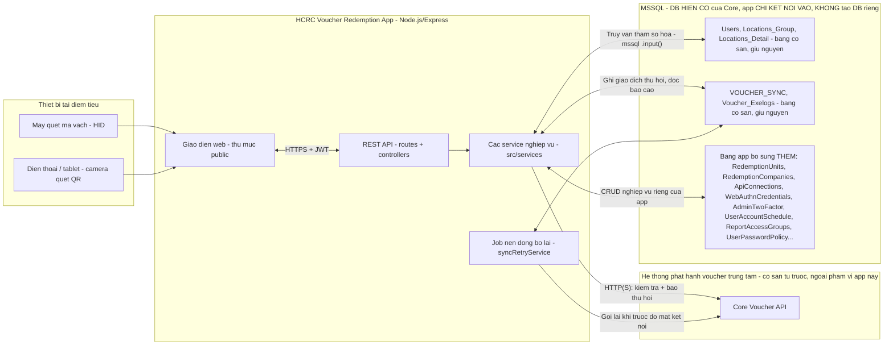
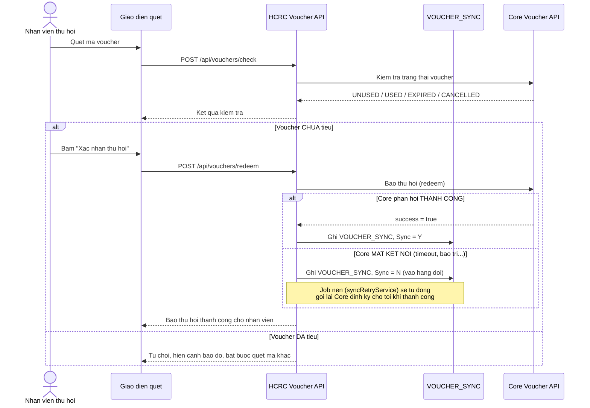

# HCRC Voucher Redemption App

Ung dung web (khong phai POS) cap cho **cac don vi doi tac** de **quet va thu hoi (redeem)
voucher tai quay**, doi chieu ngay lap tuc voi he thong phat hanh trung tam
(**Core Voucher API**), roi **bao cao lai theo tung cong ty/diem tieu** cho HCRC quan ly.

## Mo ta nghiep vu

**Nguyen tac quan trong nhat: DB nghiep vu (Users, Locations_*, VOUCHER_SYNC, Voucher_Exelogs)
la DB HIEN CO cua he thong Core — app nay KHONG tao DB rieng, chi KET NOI VAO va KE THUA toan
bo du lieu/tai khoan dang co san.** App chi bo sung THEM cac bang moi cho nghiep vu cua rieng
no (xem muc 2), tuyet doi khong sua cau truc hay xoa du lieu tren cac bang cu.

Luong nghiep vu chinh:

1. Nhan vien tai diem tieu **dang nhap** (tai khoan da co san trong `Users`, hoac tai khoan moi
   duoc admin tao/gan them — xem muc 3a, 12, 13).
2. **Quet ma voucher** bang may quet ma vach HID (cam vao PC/tablet nhu ban phim) hoac camera
   dien thoai (quet QR) — khong cho go tay de tranh do/doan ma (muc 8).
3. App goi **Core Voucher API** de **kiem tra** (`checkVoucher`) — hoi Core "voucher nay con
   dung duoc khong". Day la buoc CHI DOC, khong lam thay doi trang thai voucher.
4. Neu Core tra ve **CHUA tieu**: hien menh gia/han dung/ngay cap, cho phep nhan vien bam
   **"Xac nhan thu hoi"** → app goi tiep **`redeemVoucher`** de **bao Core** la voucher nay vua
   duoc tieu tai diem nay, dong thoi **ghi 1 dong vao `VOUCHER_SYNC`** (bang co san, dung dung
   nghiep vu cu) de phuc vu bao cao/doi soat cua rieng HCRC (vi 1 minh Core API khong biet duoc
   giao dich nay thuoc **cong ty/diem tieu nao** cua HCRC — xem muc 12).
5. Neu Core tra ve **DA tieu**: canh bao do, khong cho thu hoi, bat buoc quet ma khac.
6. **Neu mat ket noi toi Core dung luc bao thu hoi** (sau khi vua xac nhan CHUA tieu vai giay
   truoc): app **van cho thu hoi thanh cong tai quay** (khong lam gian doan khach hang dang cho),
   dua vao "hang doi dong bo" (`VOUCHER_SYNC.Sync='N'`) va co job nen tu dong gui lai cho Core
   sau — xem muc 4c.
7. Admin xem **bao cao doi soat theo ngay** (muc 5/6) va **bao cao tong hop theo khoang ngay,
   cong don theo Cong ty → Diem tieu** (muc 12) — moi tai khoan **mac dinh chi thay du lieu cong
   ty cua chinh minh**, tru khi duoc cap quyen xem cheo/xem toan bo (muc 13).
8. Cac lop bao mat bao quanh toan bo luong tren: khoa tam khi go sai lien tuc (muc 8), xac thuc
   hai yeu to bat buoc cho quan tri (muc 10), dang nhap van tay/Face ID qua PWA (muc 9), bat
   buoc doi mat khau lan dau (muc 14), gioi han thoi han su dung tai khoan (muc 11).

Stack: **Node.js (Express) + MSSQL** (ket noi vao DB hien co, khong tao DB moi).

---

## 1. Kien truc & So do ket noi he thong



**Doc so do:** app **khong bao gio thay the** Core Voucher API — Core van la **nguon su that
duy nhat** ve trang thai "da tieu/chua tieu" cua voucher. App chi dong vai tro **giao dien thu
hoi tai quay + lop bao cao theo cong ty/diem tieu** rieng cho HCRC, va **dung chung** khoi DB
nghiep vu cot loi (`Users`/`Locations_*`/`VOUCHER_SYNC`) voi he thong Core hien co thay vi tach
rieng — tranh 2 noi du lieu lech nhau.

### 1a. Luong quet - thu hoi (chi tiet xu ly khi Core mat ket noi)



**Nguyen tac kien truc:**

- App **khong tu quan ly** trang thai "da tieu/chua tieu" — do la trach nhiem cua Core Voucher
  API (nguon su that duy nhat), tranh 2 he thong lech nhau.
- Moi lan quet, app goi `checkVoucher()` sang Core API truoc, roi moi cho phep nguoi dung bam
  "Xac nhan thu hoi" (goi `redeemVoucher()`).
- Khi thu hoi thanh cong, app ghi 1 dong vao bang `VOUCHER_SYNC` (bang co san, ke thua) de dung
  lai cho bao cao doi soat/dong bo hien tai — khong tao bang moi song song lam phan manh du lieu.
- **Neu Core API mat ket noi dung luc goi bao thu hoi** (sau khi da xac nhan UNUSED it giay
  truoc do): app **van cho thu hoi thanh cong tai cho** (khong lam gian doan giao dich voi
  khach hang), ghi vao `VOUCHER_SYNC` voi `Sync='N'` nhu 1 "hang doi cho dong bo", roi 1 job
  chay dinh ky se tu dong gui lai — xem muc 4c.
- Moi lan quet (ca thanh cong lan that bai) duoc ghi vao bang moi `VoucherScanLogs` (**log thao
  tac nguoi dung**) de phuc vu tra soat, chong gian lan, debug khieu nai tu doi tac. Moi lan job
  dong bo chay (thanh cong/that bai) duoc ghi vao bang co san `Voucher_Exelogs` (**log he
  thong**), dung dung y goc cua bang nay trong schema ban gui.

## 2. Cac bang du lieu

### Da co san (khong thay doi cau truc)
- `Users`, `Locations_Group`, `Locations_Detail`: dang nhap, quan ly dia diem.
- `VOUCHER_SYNC`: noi luu ban ghi thu hoi thanh cong (app ghi vao day).

### Bo sung (xem thu muc `sql/`)
- `RedemptionUnits` (001): thong tin nghiep vu chi tiet cua **don vi thu hoi** — ma doi tac, ten, nguoi lien he, dia chi, MST, tai khoan ngan hang, han muc/ngay... Lien ket 1-1 voi `Locations_Detail` qua `LocationDetailId`, khong dung cham bang cu.
- `VoucherScanLogs` (002): log toan bo luot quet/kiem tra (ca CHECK va REDEEM), phuc vu doi soat va dieu tra khi co tranh chap.
- Cac index ho tro (003) tren `VOUCHER_SYNC` de truy van bao cao nhanh hon.
- `ApiConnections` + `ApiConnectionTestLogs` (004): luu cau hinh ket noi Core Voucher API do
  admin tu khai bao qua UI (secret duoc ma hoa) va log lich su cac lan bam nut "Test" tren
  man hinh cau hinh.
- `Voucher_Exelogs` (005, chi tao neu **CHUA** co san — moi truong that cua ban da co bang nay):
  dung lai dung muc dich goc de ghi log he thong cua job dong bo lai voucher loi — xem muc 4c.
- `WebAuthnCredentials` (006): luu **khoa cong khai** cua tung passkey (van tay/Face ID) da dang
  ky cho tung tai khoan — khong luu du lieu sinh trac hoc that (van tay/khuon mat khong bao gio
  roi khoi thiet bi cua nguoi dung) — xem muc 9.
- `AdminTwoFactor` (007): luu secret TOTP (**da ma hoa** AES-256-GCM) cua tung tai khoan quan tri
  — **bat buoc** doi voi `Users.status = 1`, khong ap dung cho nhan vien thu hoi thuong — xem muc 10.
- `UserAccountSchedule` (008): moc `ActiveFrom`/`ActiveUntil` (tuy chon) cho **tung tai khoan** —
  cho phep cap tai khoan co thoi han, tu dong kich hoat/het han dung theo 2 moc nay ma khong can
  job nen — xem muc 11.
- `RedemptionCompanies` (009) + cot `CompanyId` tren `RedemptionUnits` (010): them cap **"Cong
  ty"** phia tren tung diem tieu — 1 cong ty co the gan **nhieu diem tieu** (vd chuoi nhieu chi
  nhanh cua cung 1 doi tac). Thong tin lien he/thue/ngan hang chung cua ca cong ty nam o day,
  tach khoi tung diem — xem muc 12.
- `ReportAccessGroups`, `ReportAccessGroupCompanies`, `UserReportAccess` (011): nhom quyen xem
  bao cao cheo/toan bo cong ty, gan theo tung tai khoan — xem muc 13.
- `UserPasswordPolicy` (012): danh dau tai khoan nao **da doi mat khau** qua app nay, dung de
  bat buoc doi mat khau lan dang nhap dau tien — xem muc 14.
- `WebAuthnChallenges` (013): luu TAM challenge dang ky/dang nhap van tay-Face ID trong DB thay
  vi bo nho — de dung duoc khi chay nhieu worker (`CLUSTER_WORKERS > 1`) — xem muc 3e, 9b.

Chay migration:

```bash
npm run migrate
```

(script doc va thuc thi tuan tu cac file `.sql` trong `sql/`, an toan chay lai nhieu lan nho `IF NOT EXISTS`).

## 3. Trien khai ung dung (Deployment)

> **Doc truoc khi lam**: app nay **KHONG di kem DB rieng** — no **ket noi vao DB MSSQL hien co**
> cua he thong Core (qua 4 bien `DB_SERVER/DB_PORT/DB_NAME/DB_USER/DB_PASSWORD` trong `.env`) va
> **ke thua nguyen ven** du lieu/tai khoan dang co (`Users`, `Locations_Group`,
> `Locations_Detail`, `VOUCHER_SYNC`, `Voucher_Exelogs`). Buoc migrate (`npm run migrate`) **chi
> them bang moi cho nghiep vu rieng cua app**, khong bao gio `ALTER`/`DROP` hay sua du lieu tren
> cac bang cu — an toan chay tren DB dang production, khong can tao DB/schema moi.

**Lam theo dung thu tu sau, tu tren xuong duoi** (moi buoc deu can buoc truoc do):

| Buoc | Noi dung | Bat buoc? |
|---|---|---|
| 3a | Ket noi ke thua DB hien co + tao tai khoan admin dau tien | Bat buoc |
| 3b | Chay thu tren may local | Tuy chon (bo qua neu da quen app) |
| 3c | Cau hinh domain that cho PWA/van tay | Bat buoc neu dung tren dien thoai/tablet |
| 3d | Tao 1 tai khoan he thong rieng de chay app (khong dung tai khoan ca nhan) | Khuyen nghi manh |
| 3e | Chay that o production — chon PM2 hoac systemd, co the bat nhieu worker | Bat buoc |
| 3f | Dat Nginx phia truoc de co HTTPS | Bat buoc neu dung tren dien thoai/tablet |
| 3g | Checklist xac nhan lai truoc khi ban giao | Bat buoc |
| 3h | Quy trinh cap nhat code sau nay | Tham khao khi can |

### 3a. Ket noi ke thua DB hien co (KHONG tao DB rieng cho app nay)

App **dung chung** 100% du lieu nghiep vu cot loi voi he thong Core hien co — khong tach ra 1
DB moi, khong di chuyen/sao chep du lieu cu sang noi khac:

| Bang | Vai tro trong app moi |
|---|---|
| `Users` | Dang nhap — **giu nguyen tai khoan cu**, app chi doc/so sanh mat khau va (khi can) ghi de lai `Password` khi doi mat khau (muc 14). |
| `Locations_Group`, `Locations_Detail` | Danh muc dia diem — app chi **doc**, khong ghi. |
| `VOUCHER_SYNC` | App **ghi them dong moi** moi khi thu hoi thanh cong (giu nguyen dung y goc: noi luu ban ghi da tieu de doi soat). |
| `Voucher_Exelogs` | App **ghi them dong moi** moi lan job dong bo chay (dung y goc: log he thong). |

**Cac buoc:**

```bash
# 1) Cai dependency
npm install

# 2) Tao file cau hinh tu mau, roi SUA 5 bien DB_* tro dung DB THAT dang chay (khong phai DB test)
cp .env.example .env
```

Mo `.env`, sua **dung** thong tin ket noi cua DB that:

```ini
DB_SERVER=<ip-hoac-hostname-cua-may-chu-sql-that>
DB_PORT=1433
DB_NAME=<ten-database-hien-co-cua-Core>
DB_USER=<user-co-quyen-doc/ghi-db-nay>
DB_PASSWORD=<mat-khau>
DB_ENCRYPT=true                 # giu true neu SQL Server co cau hinh SSL (khuyen nghi)
DB_TRUST_SERVER_CERT=true       # true neu dung chung cert noi bo/tu ky; doi false neu da co CA hop le
```

> **Luu y**: tai khoan `DB_USER` toi thieu can quyen `SELECT` tren `Users`/`Locations_Group`/
> `Locations_Detail`, va `SELECT/INSERT/UPDATE` tren `VOUCHER_SYNC`/`Voucher_Exelogs`, cong them
> quyen `CREATE TABLE` (mot lan, luc chay migrate) de tao cac bang bo sung o muc 2. Neu chinh
> sach bao mat noi bo khong cho phep 1 user co quyen `CREATE TABLE` truc tiep tren DB production,
> nho DBA chay `npm run migrate` (hoac copy noi dung tung file trong `sql/` chay thu cong theo
> dung thu tu ten file 001 → 013) bang 1 tai khoan co quyen cao hon **1 lan duy nhat**, sau do
> tra lai quyen han che cho `DB_USER` dung hang ngay.

```bash
# 3) Backup DB TRUOC KHI migrate lan dau tren production (buoc bat buoc, khong duoc bo qua)
#    - Day la thao tac them bang (IF NOT EXISTS) nen rui ro rat thap, nhung backup truoc van la
#      nguyen tac an toan bat buoc voi moi thay doi tren DB dang phuc vu that.

# 4) Chay migrate - tao THEM cac bang rieng cua app (KHONG dung den bang cu)
npm run migrate
```

`npm run migrate` doc va chay tuan tu toan bo file `.sql` trong `sql/` theo thu tu ten file
(hien tai 001 → 013, xem danh sach o muc 2), moi file boc trong `IF NOT EXISTS (...)` nen
**chay lai bao nhieu lan cung an toan** (khong tao trung, khong mat du lieu) — dung dung 1 lenh
nay cho ca lan dau tien va cho moi lan sau nay code co them migration moi.

**Tai khoan cu (co san trong `Users`) dang nhap duoc ngay**, khong can thao tac gi them — mien
la cot `Password` cua ho dang la mat khau **plaintext cu** hoac **da hash bang bcrypt**
(`authService.js` ho tro doc ca 2 dang, xem muc 8). Luu y 2 rang buoc **rieng cua app** ap dung
ngay tu lan dang nhap dau (khong doi/xoa du lieu cu, chi la buoc bo sung khi dang nhap):
tai khoan `status = 1` (quan tri) bat buoc thiet lap 2FA (muc 10), va **moi tai khoan** bat buoc
doi mat khau neu chua tung doi qua app nay (muc 14).

Neu DB that **chua co san tai khoan `status = 1`** nao de dang nhap lan dau (vi du DB chi co san
tai khoan nhan vien thuong), tao 1 tai khoan quan tri moi bang script co san — **khong can vao
thang SQL Server Management Studio tu tay dieu chinh**:

```bash
npm run create-admin -- --username=admin_moi --password="MatKhauManhToiThieu8KyTu" --fullName="Ten quan tri"
```

Script `scripts/create-admin.js` se **bam mat khau bang bcrypt** (khong bao gio luu plaintext)
roi tao/cap nhat 1 dong trong `dbo.Users` voi `status = 1`. Neu `--username` da ton tai (vi du
mot tai khoan nhan vien cu), script se **cap nhat lai mat khau + nang cap tai khoan do thanh
quan tri** thay vi tao trung dong moi; co the them `--locationsGroup=...`/
`--locationsDetail=...` neu muon gan san tai khoan quan tri vao 1 dia diem cu the (thuong khong
can, vi `status = 1` mac dinh da xem/thao tac duoc toan bo he thong — muc 13). Dang nhap lan dau
bang tai khoan nay se lan luot di qua: **doi mat khau (muc 14) → thiet lap 2FA (muc 10)** truoc
khi vao duoc trang chinh.

### 3b. Chay thu tren may local (tuy chon, dung de kiem tra truoc khi len that)

```bash
npm run dev             # server dev, tu dong reload khi sua code
```

Mo trinh duyet: `http://localhost:3000` (may quet ma vach cam vao PC/tablet qua cong USB, con
dien thoai dung camera co san — camera **chi hoat dong tren `localhost` hoac HTTPS**, xem 3c).

### 3c. Cau hinh domain that cho PWA + dang nhap van tay/Face ID (WebAuthn)

App co the **cai dat nhu 1 ung dung (PWA)** va ho tro **dang nhap bang van tay/Face ID** — xem
muc 9. Ca 2 tinh nang nay **rang buoc chat voi domain that**, nen phai khai bao dung **truoc khi
dua cho nguoi dung that su dung** (doi domain sau khi da co nguoi dang ky van tay se lam **mat
het** du lieu passkey da dang ky, phai dang ky lai tu dau):

```ini
WEBAUTHN_RP_NAME=HCRC Voucher Redemption
WEBAUTHN_RP_ID=voucher.hcrc.vn            # DUNG domain that se dung lau dai, khong dat tam
WEBAUTHN_ORIGIN=https://voucher.hcrc.vn   # URL day du, BAT BUOC https:// (tru localhost khi dev)
```

> **Luu y**: `WEBAUTHN_RP_ID` phai la **domain thuan tuy** (khong co `https://`, khong co dau
> `/` hay cong o cuoi), con `WEBAUTHN_ORIGIN` phai la **URL day du** khop **chinh xac** (ca
> scheme lan domain) voi dia chi nguoi dung go tren trinh duyet — sai 1 trong 2 se lam trinh
> duyet **tu choi tham lang** hop thoai van tay/Face ID (khong bao loi ro rang), rat kho debug
> neu khong biet truoc dieu nay.

### 3d. Tao 1 tai khoan he thong rieng de chay app

`.env` chua **plaintext** `DB_PASSWORD`, `JWT_SECRET`, `ENCRYPTION_KEY`... — day la cach lam
**binh thuong va du dung** cho quy mo 1 server nhu app nay (khong can ma hoa noi dung file nay:
neu ma hoa ma chia khoa giai ma van nam tren cung server, ke tan cong chiem duoc server se lay
duoc ca 2 cung luc, khong tang them bao ve thuc su). Lop phong thu dung thuc su la **gioi han
ai/tien trinh nao doc duoc file nay** — bang cach cho app chay duoi 1 tai khoan he thong RIENG,
KHONG dung chung voi tai khoan ca nhan hang ngay cua admin:

```bash
# 1) Tao 1 user he thong RIENG cho app - KHONG the dang nhap/SSH truc tiep bang user nay
sudo useradd --system --no-create-home --shell /usr/sbin/nologin hcrcapp

# 2) Chuyen quyen so huu toan bo thu muc app (dac biet la .env) cho dung user nay
sudo chown -R hcrcapp:hcrcapp /duong-dan/toi/hcrc-voucher

# 3) Khoa .env chi minh chu so huu (hcrcapp) moi doc/ghi duoc
sudo chmod 600 /duong-dan/toi/hcrc-voucher/.env
```

> **Vi sao lam vay**: neu app chay bang chinh tai khoan SSH ca nhan hang ngay cua admin, ai do
> sau nay chiem duoc quyen dang nhap tai khoan do (do mat khau SSH, lo SSH key...) se **tu dong**
> doc duoc `.env` luon. Tach ra 1 service account rieng, **khong co mat khau/khong dang nhap
> duoc**, thu hep con duong doc file nay lai chi con: (1) chiem duoc chinh tien trinh app dang
> chay (lo hong trong code), hoac (2) co san quyen `root`/`sudo` — ca 2 deu nghiem trong hon
> nhieu so voi "do duoc 1 mat khau SSH thuong". Luu y `root` luon doc duoc moi file bat ke
> `chmod` gi — 600 khong chong duoc ke da co quyen root, no chong cac user **khac** khong co
> quyen root tren cung may chu.

Muc 3e ben duoi se cho app **chay bang dung user `hcrcapp` nay**, dung ca cho PM2 lan systemd.

**Sau nay moi lan can sua `.env`** (vi du doi mat khau DB, xoay `JWT_SECRET`...): **khong dang
nhap bang `root` hay bang `hcrcapp`** (ca 2 von khong cho dang nhap truc tiep) — admin van dung
tai khoan ca nhan cua minh SSH vao server (can nam trong nhom `sudo`), roi chon 1 trong 2 cach:

```bash
# Cach 1 - sua bang quyen root (root luon doc/ghi duoc moi file, bat ke chmod gi):
sudo nano /duong-dan/toi/hcrc-voucher/.env
# Sau khi luu, KIEM TRA/DAT LAI quyen so huu (mot so trinh soan thao xoa-tao lai file khi luu,
# co the vo tinh doi chu so huu ve root khien app khong con doc duoc .env nua):
sudo chown hcrcapp:hcrcapp /duong-dan/toi/hcrc-voucher/.env
sudo chmod 600 /duong-dan/toi/hcrc-voucher/.env

# Cach 2 (khuyen nghi, sach hon) - chay thang trinh soan thao DUOI danh tinh hcrcapp, khong can
# nho buoc chown lai vi file van do dung chu so huu tao ra:
sudo -u hcrcapp nano /duong-dan/toi/hcrc-voucher/.env
```

> `sudo -u hcrcapp <lenh>` chi la "muon quyen tam thoi de chay 1 lenh", khong phai dang nhap mo
> phien lam viec cua `hcrcapp` — nen van chay duoc binh thuong du user nay khai bao
> `--shell /usr/sbin/nologin` (chi chan mo shell tuong tac/SSH, khong chan `sudo -u` goi thang
> 1 chuong trinh cu the).

### 3e. Chay that o production: 2 cach + cluster nhieu worker

`npm run dev`/`npm start` chi phu hop dev/demo — khi chay that can 1 **process manager** de:
(1) tu dong khoi dong lai app neu crash, (2) tu dong chay lai app khi server reboot, (3) quan ly
log gon gang. Chon **1 trong 2 cach** duoi day (khong can lam ca 2) — ca 2 deu chay app bang
user `hcrcapp` da tao o muc 3d, va ca 2 deu ho tro **chay nhieu worker song song** theo cach
giong het nhau (xem phan "Chay nhieu worker" ngay ben duoi).

#### Cach 1: Chay bang PM2 (don gian, quen thuoc voi nguoi hay dung Node.js)

```bash
# 1) Cai PM2 (chi 1 lan, cai global cho toan he thong)
sudo npm install -g pm2

# 2) Khoi dong app BANG DUNG USER hcrcapp (khong dung tai khoan ca nhan cua admin) - luu y PM2
#    quan ly danh sach tien trinh RIENG cho tung user, nen tu day ve sau moi lenh pm2 lien quan
#    toi app nay deu phai chay kem "sudo -u hcrcapp" nhu duoi day.
sudo -u hcrcapp pm2 start src/server.js --name hcrc-voucher --cwd /duong-dan/toi/hcrc-voucher

# 3) Luu lai danh sach tien trinh hien tai cua user hcrcapp
sudo -u hcrcapp pm2 save

# 4) Dang ky PM2 tu khoi dong lai cung he dieu hanh sau khi reboot server - lenh nay se IN RA
#    1 dong lenh "sudo env PATH=... pm2 startup systemd -u hcrcapp --hp ..." - COPY va chay
#    dung dong do (khong tu doan, moi may in ra duong dan khac nhau)
sudo -u hcrcapp pm2 startup
```

**Cac lenh thuong dung sau khi da chay** (luon nho kem `sudo -u hcrcapp` vi app chay duoi user do):

```bash
sudo -u hcrcapp pm2 list                    # xem trang thai (online/stopped), uptime, so lan restart
sudo -u hcrcapp pm2 logs hcrc-voucher       # xem log truc tiep (Ctrl+C de thoat, khong dung app)
sudo -u hcrcapp pm2 restart hcrc-voucher    # khoi dong lai (vd sau khi sua .env hoac cap nhat code)
sudo -u hcrcapp pm2 stop hcrc-voucher       # dung han (khong tu bat lai cho toi khi restart)
```

> **Quan trong — KHONG dung ca `pm2 -i` lan `CLUSTER_WORKERS` cung luc**: PM2 co san 1 co che
> cluster rieng qua co `-i <so-tien-trinh>`, nhung app nay da tu lam cluster BEN TRONG
> `src/server.js` (xem phan "Chay nhieu worker" ngay duoi) de dung duoc voi ca systemd chu
> khong chi PM2. Neu bat ca 2 cung luc (`pm2 start ... -i 4` VA `CLUSTER_WORKERS=4` trong
> `.env`), ban se vo tinh chay **4 tien trinh PM2, moi tien trinh lai tu fork them 4 worker con
> = 16 tien trinh** thay vi 4 nhu mong muon. Voi PM2, luon de **mac dinh (khong dung `-i`)**, chi
> dieu chinh so worker qua `CLUSTER_WORKERS` trong `.env`.

#### Cach 2: Chay bang systemd service (khong can cai them goi nao, co san tren moi distro Linux hien dai)

```bash
# 1) Tao file dinh nghia service
sudo nano /etc/systemd/system/hcrc-voucher.service
```

Dan noi dung sau (sua duong dan cho dung voi noi ban da clone/giai nen code):

```ini
[Unit]
Description=HCRC Voucher Redemption App
After=network.target

[Service]
Type=simple
User=hcrcapp
Group=hcrcapp
WorkingDirectory=/duong-dan/toi/hcrc-voucher
ExecStart=/usr/bin/node src/server.js
Restart=on-failure
RestartSec=5

[Install]
WantedBy=multi-user.target
```

(App tu doc `.env` bang thu vien `dotenv` ngay khi khoi dong — chi can `WorkingDirectory` dung
chinh xac thu muc chua `.env` la du, khong can khai bao them `EnvironmentFile=` trong file nay.)

```bash
# 2) Bao systemd nap lai cau hinh (bat buoc moi lan tao/sua file .service)
sudo systemctl daemon-reload

# 3) Bat tu dong chay cung he dieu hanh sau khi reboot server
sudo systemctl enable hcrc-voucher

# 4) Khoi dong app ngay bay gio
sudo systemctl start hcrc-voucher
```

**Cac lenh thuong dung sau khi da chay:**

```bash
sudo systemctl status hcrc-voucher     # xem app dang chay hay loi, PID, thoi gian uptime
sudo journalctl -u hcrc-voucher -f     # xem log truc tiep (tuong duong pm2 logs, Ctrl+C de thoat)
sudo systemctl restart hcrc-voucher    # khoi dong lai (vd sau khi sua .env hoac cap nhat code)
sudo systemctl stop hcrc-voucher       # dung han
```

#### Nen chon PM2 hay systemd?

Ca 2 deu dam bao app tu khoi dong lai khi crash/reboot server va deu ho tro cluster nhu nhau
(vi cluster nam trong chinh code cua app, khong phu thuoc process manager nao) — khac biet chi
o trai nghiem quan tri:

| Tieu chi | PM2 | systemd |
|---|---|---|
| Can cai them goi ngoai | Co (`npm install -g pm2`) | Khong (co san tren Linux) |
| Xem log | `pm2 logs` | `journalctl -u ...` |
| Quen thuoc voi | Nguoi quen he sinh thai Node.js | Nguoi quen quan tri Linux server noi chung |
| Theo doi CPU/RAM tien trinh | Co san lenh `pm2 monit` | Can them cong cu ngoai (`systemctl status`, `htop`...) |

Neu khong chac chon gi, **PM2** thuong de bat dau hon voi nguoi quen viet code Node.js; **systemd**
phu hop hon neu server da co san quy trinh quan tri dich vu bang systemd cho cac app khac.

#### Chay nhieu worker (cluster) de tan dung nhieu nhan CPU

App dung san module `cluster` cua Node.js (`src/server.js`) de chay **nhieu tien trinh worker
song song**, tat ca cung lang nghe chung 1 cong — Node tu dong chia deu request cho cac worker,
khong can cau hinh gi them o Nginx hay process manager. Bat qua **1 bien duy nhat** trong `.env`:

```ini
CLUSTER_WORKERS=1      # mac dinh - 1 tien trinh duy nhat, giong het truoc khi co tinh nang nay
CLUSTER_WORKERS=4      # chay dung 4 worker xu ly HTTP song song
CLUSTER_WORKERS=max    # chay bang dung so nhan CPU cua may chu
```

Sau khi doi `CLUSTER_WORKERS`, khoi dong lai app (`pm2 restart hcrc-voucher` hoac
`systemctl restart hcrc-voucher`) de ap dung.

**Co che hoat dong** (khong can hieu de dung, chi de biet vi sao an toan): khi `CLUSTER_WORKERS
> 1`, tien trinh dau tien tu fork ra N tien trinh con de xu ly HTTP, ban than no **khong nhan
request nao ca** — chi giu 1 ket noi DB rieng de chay **DUY NHAT 1 lan** job nen dong bo voucher
loi (muc 4c). Neu de moi worker tu chay job nay se bi lap lai N lan song song, gay goi trung
Core API — app da tu xu ly de tranh dieu nay, khong can cau hinh gi them.

> **Luu y quan trong ve bao mat khi dung nhieu worker**: co che khoa tam dang nhap sai nhieu lan
> (`loginGuard`/`guessGuard`, muc 8) dang dem so lan sai **trong bo nho cua tung tien trinh**.
> Voi N worker, 1 nguoi dang go sai lien tuc co the roi vao worker khac nhau moi lan (Node chia
> request theo kieu xoay vong) — nguong khoa tren thuc te co the long hon toi da khoang N lan
> so voi con so cong bo (vd nguong 5 lan/khoa cua nhan vien co the thanh ~5×N lan neu chia deu
> qua N worker). Day la danh doi da can nhac: voi vai worker (2-4), muc do long hon nay van con
> chap nhan duoc; neu can dem chinh xac tuyet doi bat ke bao nhieu worker, phai chuyen bo dem
> nay sang luu o DB thay vi bo nho (chua trien khai — lien he neu can). Rieng challenge dang
> nhap van tay/Face ID (WebAuthn) **da luu san trong DB** (`dbo.WebAuthnChallenges`, migration
> 013) nen KHONG bi anh huong boi so worker — dang ky/dang nhap van tay hoat dong binh thuong
> du chay bao nhieu worker.

### 3f. Reverse proxy Nginx + HTTPS

Dat Nginx phia truoc app de xu ly HTTPS bang chung chi that (vd Let's Encrypt) — app tu than
chi lang nghe HTTP thuan o cong noi bo, du dang chay 1 tien trinh hay nhieu worker (Nginx luon
chi tro vao **1 cong duy nhat**, khong doi gi khi ban tang/giam `CLUSTER_WORKERS`):

```nginx
server {
    listen 443 ssl http2;
    server_name voucher.hcrc.vn;               # PHAI trung voi WEBAUTHN_RP_ID o 3c

    ssl_certificate     /etc/letsencrypt/live/voucher.hcrc.vn/fullchain.pem;
    ssl_certificate_key /etc/letsencrypt/live/voucher.hcrc.vn/privkey.pem;

    location / {
        proxy_pass http://127.0.0.1:3000;      # cong noi bo app dang lang nghe
        proxy_set_header Host $host;
        proxy_set_header X-Real-IP $remote_addr;
        proxy_set_header X-Forwarded-Proto $scheme;   # QUAN TRONG: giup app biet request goc la https
    }
}

server {
    listen 80;
    server_name voucher.hcrc.vn;
    return 301 https://$host$request_uri;      # ep toan bo HTTP chuyen sang HTTPS
}
```

> **Vi sao bat buoc HTTPS**: trinh duyet **chi cho phep** truy cap camera (quet QR tren dien
> thoai — muc 6) va API WebAuthn (van tay/Face ID — muc 9) tren nguon **an toan** (`https://`
> hoac rieng `localhost` khi dev). Thieu HTTPS o production, 2 tinh nang nay se **am tham khong
> hoat dong** tren dien thoai/tablet cua nhan vien (may quet HID qua USB thi khong bi anh huong,
> vi khong can quyen camera).

### 3g. Checklist xac nhan sau khi trien khai

- [ ] `npm run migrate` chay xong khong loi (xem log co dong "Migration complete").
- [ ] Dang nhap thu **1 tai khoan nhan vien cu** co san trong `Users` — vao duoc, hien dung ho
      ten/dia diem cua ho.
- [ ] Dang nhap thu **tai khoan admin** (cu hoac vua tao qua `create-admin` o 3a) — di qua dung
      thu tu doi mat khau (neu lan dau) → thiet lap 2FA → vao duoc trang chinh.
- [ ] Quet thu **1 ma voucher that** (hoac ma test da biet truoc trang thai o Core) — kiem tra
      dung ket qua UNUSED/USED, xac nhan thu hoi thanh cong, kiem tra co ban ghi moi trong
      `VOUCHER_SYNC` (nguoi tieu, dia diem, so tien dung).
- [ ] Vao **"Ket noi API"** (muc 4) xac nhan dang tro dung Core API production (khong con tro
      sang moi truong test), bam **"Test kiem tra"** voi 1 ma that de chac chan mapping dung.
- [ ] Mo bang HTTPS tu **dien thoai that** (khong phai localhost) — thu quet camera va dang ky
      van tay/Face ID de xac nhan `WEBAUTHN_RP_ID`/`WEBAUTHN_ORIGIN` (3c) da cau hinh dung.
- [ ] Kiem tra job dong bo nen dang chay (log dinh ky theo `SYNC_RETRY_INTERVAL_MINUTES`, muc 4c).
- [ ] `JWT_SECRET` va `ENCRYPTION_KEY` trong `.env` la **chuoi ngau nhien du dai, rieng cho moi
      truong production** (khong dung lai gia tri mau/dev) — va da **luu tru an toan o noi khac**
      (vd trinh quan ly secret cua cong ty), vi mat `ENCRYPTION_KEY` sau khi da co du lieu that
      se **khong the giai ma lai** secret cua ket noi Core API/2FA da luu (xem muc 8).
- [ ] `.env` da duoc `chown` cho 1 service account rieng (khong dang nhap duoc) va `chmod 600`,
      process manager (PM2/systemd) chay bang dung user do — **khong** chay app bang tai khoan
      SSH ca nhan cua admin (xem muc 3d).
- [ ] Neu bat `CLUSTER_WORKERS > 1`: dang nhap/dang xuat thu vai lan, quet-thu-hoi thu vai
      voucher, dang ky + dang nhap thu van tay/Face ID — xac nhan moi thu hoat dong binh thuong
      du request co the roi vao worker khac nhau (xem luu y bao mat o muc 3e).

### 3h. Cap nhat len phien ban code moi sau nay

```bash
git pull                  # lay code moi
npm install                # cap nhat dependency neu package.json co thay doi
npm run migrate            # AN TOAN chay lai - chi ap dung migration MOI (file .sql chua ton tai)
pm2 restart hcrc-voucher   # (hoac lenh restart tuong ung voi process manager dang dung)
```

Vi moi migration deu la **cong bang moi, khong sua bang cu**, quy trinh cap nhat khong can
downtime bao lau va khong co buoc "rollback schema" phuc tap — truong hop can lui code ve
phien ban truoc, chi can `git checkout` lai commit cu va khoi dong lai process (cac bang moi
du con ton tai trong DB cung khong anh huong gi den code cu, vi code cu don gian la khong biet
den chung).

## 4. Cau hinh ket noi Core Voucher API qua giao dien Admin (khuyen nghi)

Thay vi sua code, admin co the tu cau hinh + test ket noi Core API ngay tren web tai
**menu "Ket noi API"** (`/api-connection.html`, yeu cau tai khoan admin — `Users.status = 1`).

Man hinh cho phep khai bao truc quan, khong can biet lap trinh:

1. **Base URL + xac thuc**: Bearer token / API key theo header rieng / Basic Auth. Secret duoc
   **ma hoa AES-256-GCM** truoc khi luu vao DB (bang `ApiConnections`), khong bao gio tra ve
   plaintext cho trinh duyet sau khi luu (chi hien "da luu, de trong de giu nguyen").
2. **Endpoint kiem tra (Check)**: chon method GET/POST, khai bao ma voucher nam o dau
   (path `{code}` / query string / body JSON), va **anh xa duong dan field** trong response
   JSON tra ve (vi du `status`, `valueAmt`, `issueDate`...) sang cac truong chuan cua app.
   Ho tro them **bang anh xa gia tri trang thai** (vi du Core API tra `"0"` -> app hieu la
   `UNUSED`) vi moi he thong dat ten trang thai khac nhau.
3. **Endpoint thu hoi (Redeem)**: tuong tu, cho phep soan body JSON template voi cac placeholder
   `{code} {username} {locationsGroup} {locationsDetail} {transNum}`.
4. **Test ngay khi cau hinh**: nhap 1 ma voucher that, bam **"Test kiem tra"** de goi thang
   sang Core API bang dung cau hinh dang go tren form (chua can bam Luu) va xem ket qua
   chuan hoa + response tho ngay lap tuc — phat hien loi mapping truoc khi kich hoat cho
   toan bo doi tac su dung. Co rieng nut **"Test thu hoi"** (co canh bao + checkbox xac nhan
   bat buoc) vi thao tac nay se **tieu that** voucher tren he thong Core, khong the hoan tac.
5. Co the tao nhieu ket noi (vi du Test/Production) nhung chi 1 ket noi duoc **"Kich hoat"**
   tai 1 thoi diem — do la ket noi ma toan bo man hinh quet voucher dang su dung
   (`src/services/coreVoucherService.js` tu doc ket noi dang active tu DB).

Neu **chua** cau hinh/kich hoat ket noi nao tren UI, app se **fallback** dung cau hinh tinh
trong `.env` (`CORE_API_*`) voi hop dong JSON co dinh mo ta o muc 4b ben duoi — giup app van
chay duoc trong luc admin dang thiet lap ket noi qua UI.

### 4b. Hop dong fallback qua .env (chi ap dung khi chua co ket noi nao tren UI)

File lien quan: `src/services/coreVoucherService.js` (ham `*LegacyEnv`).

**Kiem tra voucher** — `GET {CORE_API_BASE_URL}{CORE_API_CHECK_PATH}?voucherCode=ABC123456789`
```json
// response mong doi (200)
{
  "found": true,
  "status": "UNUSED",              // UNUSED | USED | EXPIRED | CANCELLED
  "serial": "SR-000123",
  "valueAmt": 200000,
  "issueDate": "2026-01-01T00:00:00Z",
  "expiryDate": "2026-12-31T23:59:59Z"
}
```

**Thu hoi (danh dau da tieu)** — `POST {CORE_API_BASE_URL}{CORE_API_REDEEM_PATH}`
```json
// request
{
  "voucherCode": "ABC123456789",
  "redeemedBy": "username",
  "locationsGroup": "GRP01",
  "locationsDetail": "LOC01",
  "transNum": "260903153000A1B2C3"
}

// response mong doi (200)
{ "success": true, "status": "REDEEMED", "transRef": "...", "redeemedAt": "2026-09-03T15:30:00Z" }
```

Neu Core API that co field name/cau truc khac, chi can sua 2 ham `normalizeCheckResponse()` va `normalizeRedeemResponse()` trong file tren — phan con lai cua app khong can dong vao.

App co goi lai `checkVoucher()` mot lan nua ngay truoc khi thuc su redeem (chong truong hop 2 nguoi quet cung 1 voucher gan nhu dong thoi); ngoai ra viec dam bao **khong the tieu trung 1 voucher 2 lan** van phai do Core API xu ly (vi du bang unique constraint / optimistic lock ben do), vi day la nguon du lieu goc.

### 4c. Hang doi dong bo khi Core API loi ket noi luc thu hoi

Phan biet **2 loai that bai khac nhau** khi goi POST bao Core thu hoi (`src/services/voucherService.js`):

| Loai that bai | Xu ly |
|---|---|
| Core **phan hoi ro rang** la khong the tieu (vd voucher vua bi nguoi khac tieu, het han) | **Tu choi** thu hoi ngay, khong luu gi ca — day la loi nghiep vu that. |
| **Khong ket noi duoc** Core (mat mang, Core dang bao tri, timeout...) | **Van cho thu hoi thanh cong tai cho** (vi da xac nhan UNUSED it giay truoc), luu vao `VOUCHER_SYNC` voi `Sync='N'` — coi nhu dua vao "hang doi cho dong bo". |

Job **`src/services/syncRetryService.js`** chay dinh ky (cau hinh qua `.env`, khong can sua code):

```
SYNC_RETRY_ENABLED=true             # bat/tat job
SYNC_RETRY_INTERVAL_MINUTES=5       # chu ky chay
SYNC_RETRY_BATCH_SIZE=20            # so ban ghi toi da/lot
SYNC_RETRY_MAX_ATTEMPTS=20          # so lan thu lai toi da/1 ban ghi truoc khi tam bo qua
```

Moi lot chay: doc cac dong `VOUCHER_SYNC.Sync = 'N'`, goi lai request thu hoi cho tung dong.
Thanh cong (hoac Core tra ve voucher **da o trang thai USED** — rat co the chinh la do request
lan truoc cua chung ta da toi noi nhung bi mat ket noi truoc khi nhan duoc phan hoi) thi coi nhu
**da dong bo**, set `Sync='Y'` — ban ghi **bien mat khoi hang doi**. That bai thi giu `Sync='N'`
de thu lai lan sau, tru khi vuot qua `SYNC_RETRY_MAX_ATTEMPTS` thi tam bo qua (van giu `Sync='N'`
de con nguoi ra soat thu cong qua bao cao — khong bao gio am tham xoa/mat du lieu).

Moi lan thu (thanh cong hay that bai) deu duoc ghi vao `Voucher_Exelogs` — xem duoc lich su day
du bang cach truy van `pro_name = 'VoucherRedeemSync'`.

### 4d. Tra cuu CSDL noi bo TRUOC khi hoi Core luc kiem tra (rut ngan duong tu choi)

Buoc **kiem tra** (`POST /vouchers/check`, TRUOC khi thu hoi — khac voi buoc **redeem** ben
duoi, buoc redeem van luon phai hoi Core truc tiep, khong doi) tra `VOUCHER_SYNC` (CSDL noi bo
cua chinh app nay) THEO MA VOUCHER truoc, roi moi hoi Core:

- **Tim thay trong local** (ke ca ban ghi dang `Sync='N'` cho dong bo): **chac chan da tieu**
  (chinh app nay da ghi nhan) → tra loi "da su dung" **ngay lap tuc**, **khong goi Core** — nhanh
  hon va giam tai Core, dung cho tinh huong hay gap: nhan vien quet nham lai dung ma vua tieu
  xong.
- **Khong thay trong local**: **KHONG the ket luan la con dung duoc** (co the da bi tieu qua
  kenh khac ngoai app nay, neu Core con phuc vu them kenh nao khac) → van phai hoi Core **y het
  nhu truoc**, khong duoc bo qua buoc nay.

Noi cach khac, day chi la 1 "duong tat" 1 chieu de **tu choi nhanh hon** — Core van la **nguon
su that duy nhat** cho cau tra loi "con dung duoc". Tan dung index co san `IX_VOUCHER_SYNC_Voucher_Code`
(migration 003) nen tra cuu rat nhanh du bang co nhieu du lieu. Xem `voucherService.js#checkVoucher`.

## 5. API cua app nay (danh cho web/mobile UI)

Tat ca endpoint (tru `/auth/login`) yeu cau header `Authorization: Bearer <token>`.

| Method | Path | Mo ta |
|---|---|---|
| POST | `/api/auth/login` | Dang nhap, tra ve JWT |
| GET | `/api/locations/groups` | Danh sach nhom dia diem |
| GET | `/api/locations/details` | Danh sach dia diem chi tiet |
| GET | `/api/redemption-units` | Danh sach diem tieu (kem ten cong ty) |
| POST | `/api/redemption-units` | Them diem tieu, bat buoc gan `companyId` (can quyen admin) |
| PUT | `/api/redemption-units/:id` | Cap nhat diem tieu (can quyen admin) |
| GET | `/api/companies` | Danh sach cong ty |
| POST | `/api/companies` | Them cong ty (can quyen admin) |
| PUT | `/api/companies/:id` | Cap nhat cong ty (can quyen admin) |
| POST | `/api/vouchers/check` | Quet/kiem tra voucher qua Core API (khong doi trang thai) |
| POST | `/api/vouchers/redeem` | Xac nhan thu hoi (goi Core API + luu VOUCHER_SYNC) |
| GET | `/api/reports/daily?date=YYYY-MM-DD` | Bao cao doi soat theo ngay (nhom theo dia diem tai khoan) |
| GET | `/api/reports/summary?fromDate=YYYY-MM-DD&toDate=YYYY-MM-DD` | Bao cao tong hop theo khoang ngay (nhom Cong ty -> Diem tieu) — muc 12 |
| GET | `/api/reports/used-vouchers?fromDate=&toDate=` | Danh sach PHANG toan bo voucher da su dung (2 tham so ngay tuy chon, de trong = toan bo lich su) — muc 12c |
| GET | `/api/reports/used-vouchers/export?fromDate=&toDate=` | Xuat cung danh sach tren ra file Excel (.xlsx) — muc 12c |
| GET | `/api/api-connections` | Danh sach ket noi Core API (can quyen admin, secret duoc mask) |
| GET/POST/PUT/DELETE | `/api/api-connections[/:id]` | CRUD ket noi Core API (can quyen admin) |
| POST | `/api/api-connections/:id/activate` | Kich hoat 1 ket noi lam ket noi chinh |
| POST | `/api/api-connections/test-check` | Test kiem tra voucher that voi cau hinh dang nhap tren form/da luu |
| POST | `/api/api-connections/test-redeem` | Test thu hoi voucher that (bat buoc `confirmRedeem: true`) |
| POST | `/api/auth/2fa/setup-init` | (token tam hoac phien admin) Sinh QR + ma thu cong de thiet lap 2FA |
| POST | `/api/auth/2fa/setup-verify` | (token tam hoac phien admin) Xac nhan ma TOTP, bat 2FA |
| POST | `/api/auth/2fa/login-verify` | (token tam) Nhap ma TOTP de hoan tat dang nhap (admin da bat 2FA) |
| GET | `/api/auth/2fa/status` | (can quyen admin) Trang thai 2FA cua chinh minh |
| GET | `/api/auth/2fa/admins` | (can quyen admin) Danh sach quan tri vien + trang thai 2FA |
| DELETE | `/api/auth/2fa/admins/:userId` | (can quyen admin) Go 2FA cua **admin khac** (khong tu go duoc cua chinh minh) |
| GET | `/api/users` | (can quyen admin) Danh sach tai khoan + lich hieu luc + trang thai hien tai |
| PUT | `/api/users/:userId/schedule` | (can quyen admin) Dat/sua `ActiveFrom`/`ActiveUntil` cua 1 tai khoan |
| POST | `/api/auth/webauthn/login-options` | (cong khai) Lay challenge de dang nhap bang van tay/Face ID |
| POST | `/api/auth/webauthn/login-verify` | (cong khai) Xac minh phan hoi tu thiet bi, tra ve JWT neu dung |
| POST | `/api/auth/webauthn/register-options` | Lay challenge de dang ky passkey moi cho tai khoan dang dang nhap |
| POST | `/api/auth/webauthn/register-verify` | Xac minh + luu passkey moi vao `WebAuthnCredentials` |
| GET | `/api/auth/webauthn/devices` | Danh sach passkey da dang ky cua tai khoan dang dang nhap |
| DELETE | `/api/auth/webauthn/devices/:id` | Xoa 1 passkey (vi du mat thiet bi) |

Vi du `POST /api/vouchers/check`:
```json
{ "voucherCode": "ABC123456789", "scanMethod": "HID_SCANNER" }
```
Tra ve khi chua tieu:
```json
{
  "success": true,
  "data": {
    "canRedeem": true,
    "status": "UNUSED",
    "voucherSerial": "SR-000123",
    "valueAmt": 200000,
    "issueDate": "2026-01-01T00:00:00Z",
    "expiryDate": "2026-12-31T23:59:59Z"
  }
}
```
Tra ve khi da tieu:
```json
{
  "success": true,
  "data": { "canRedeem": false, "status": "USED", "message": "Voucher nay da duoc su dung. Vui long quet ma voucher khac." }
}
```

## 6. Giao dien web (thu muc `public/`)

- `login.html`: dang nhap.
- `index.html`: man hinh quet chinh — 1 o input nhan du lieu tu may scan HID (tu dong focus, Enter = kiem tra) va nut "Quet bang camera" (dung thu vien `html5-qrcode` qua CDN) cho dien thoai/tablet khong co may scan roi.
- `units.html`: **(admin)** quan ly cong ty + diem tieu voucher (them/xem) — xem muc 12.
- `report.html`: bao cao doi soat theo ngay, theo tung dia diem tai khoan dang nhap.
- `summary-report.html`: bao cao tong hop theo khoang ngay, nhom Cong ty -> Diem tieu, cong don
  2 cap + tong toan bo cong ty — tach biet voi `report.html` — xem muc 12.
- `used-vouchers.html`: danh sach PHANG toan bo voucher da su dung (khong cong don), loc theo
  ngay tuy chon, co nut **xuat Excel** — xem muc 12c.
- `api-connection.html`: **(admin)** khai bao/kich hoat ket noi Core Voucher API va test truc tiep
  bang voucher that ngay khi cau hinh — xem chi tiet o muc 4.

Luong quet tren UI:
1. Quet ma (may quet HID hoac camera — **khong the go tay**, xem muc 7) -> goi `/vouchers/check`.
2. Neu **chua tieu**: hien menh gia/han dung/ngay cap + nut "Xac nhan thu hoi".
3. Bam xac nhan -> goi `/vouchers/redeem` -> luu vao `VOUCHER_SYNC`, hien thong bao thanh cong
   (hoac "dang cho dong bo" neu Core tam thoi mat ket noi — xem muc 4c), bang giao dich gan day
   hien cot "Dong bo" (DA DONG BO / CHO DONG BO), tu dong focus lai o quet cho ma tiep theo.
4. Neu **da tieu**: hien canh bao do, chi con nut "Quet ma khac" — khong cho thu hoi.

## 7. Hieu nang

- Response (JSON API lan file tinh JS/CSS/HTML) duoc **nen gzip** qua middleware `compression`
  (`src/app.js`) — giam bang thong tai, quan trong voi cac diem thu hoi co duong truyen yeu.

## 8. Bao mat

- **CSP nghiem ngat, khong `unsafe-inline`/`unsafe-eval`** (`src/app.js`, qua `helmet`): toan bo
  CSS/JS nam trong file rieng (khong con the `<style>`/`<script>` inline hay thuoc tinh
  `style="..."` trong bat ky trang nao), script-src/style-src/font-src chi allowlist dung cac
  host thuc su can (Google Fonts, `unpkg.com` cho thu vien quet QR). Helmet cung tu bat kem cac
  header bao mat khac (`X-Content-Type-Options`, `X-Frame-Options: DENY`,
  `Referrer-Policy`, HSTS...).
- **Chong XSS**: moi du lieu dong hien thi ra trang (ke ca response tu Core API — nguon du lieu
  ben ngoai, rui ro cao nhat) deu di qua `escapeHtml()` truoc khi ghep vao `innerHTML`, hoac dung
  `.textContent` (khong parse HTML) cho cac khoi hien thi JSON tho — xem `public/js/*.js`.
- **Chong SQL injection**: toan bo truy van MSSQL dung tham so hoa qua `.input()` cua `mssql`
  (khong bao gio noi chuoi gia tri nguoi dung truc tiep vao van ban SQL) — ap dung nhat quan cho
  moi service trong `src/services/`.
- **Chong go tay/do ma voucher**: giao dien quet chi nhan tin hieu tu may quet that (phat hien
  qua toc do go phim) hoac camera, chan paste/keo-tha — xem `public/js/scan.js`. Phia server co
  them `guessGuard` (`src/utils/guessGuard.js`) tam khoa tai khoan sau nhieu lan kiem tra ra ma
  khong ton tai lien tiep, vi gioi han o giao dien co the bi vuot qua neu goi thang API bang token
  hop le.
- **Chong do/vet mat khau dang nhap**: `loginGuard` (`src/utils/loginGuard.js`) khoa tam **theo
  ten dang nhap** (khong theo IP, vi thiet bi tai quay thuong dung chung cho nhieu nhan vien);
  dang nhap dung trong luc dang bi khoa van bi tu choi (khong "mo khoa som" bang mat khau dung,
  tranh do sai lien tuc de tim cua so ho). Ap dung **nhat quan cho ca 3 duong dang nhap**: mat
  khau, van tay/Face ID, va nhap ma xac thuc hai yeu to (muc 10) — dung 1 bo dem chung theo tai
  khoan. **2 muc nguong khac nhau theo vai tro**:
  | Vai tro | Nguong | Cua so | Thoi gian khoa |
  |---|---|---|---|
  | Nhan vien thu hoi (`status=0`) | 5 lan sai | 10 phut | 15 phut |
  | Quan tri (`status=1`) | 50 lan sai | 15 phut | 2 phut |

  Admin dung nguong long hon han vi da co lop **xac thuc hai yeu to** (muc 10) chan phia sau —
  do dung mat khau/van tay khong con du de vao duoc, nen nguong 5 lan/khoa 15 phut cu de bi loi
  dung nguoc lai thanh **DoS chinh admin** (ai biet username admin chi can go sai 5 lan lien tuc
  la khoa duoc ho, lap lai vo han). Nhan vien khong co 2FA nen van giu nguyen muc nghiem ngat.
- **Xac thuc hai yeu to (2FA) bat buoc cho quan tri**: tai khoan `Users.status = 1` khong the vao
  duoc ung dung neu chua thiet lap 2FA (TOTP) — xem muc 10. Token cap ngay sau khi dang nhap
  dung mat khau/van tay nhung **chua** qua 2FA la token TAM (`purpose` khac `'session'`), bi
  `middleware/auth.js` tu choi thang neu dem goi bat ky API nghiep vu nao khac ngoai 2 buoc
  thiet lap/xac minh 2FA.
- Doi mat khau demo, dat `JWT_SECRET` va `ENCRYPTION_KEY` ngau nhien du dai truoc khi deploy.
  `ENCRYPTION_KEY` dung de ma hoa token/API key/password cua ket noi Core API (`ApiConnections`)
  va secret TOTP cua 2FA (`AdminTwoFactor`) — **khong duoc doi hoac lam mat key nay** sau khi da
  co du lieu that, neu khong se khong giai ma lai duoc cac secret da luu (phai nhap lai/thiet lap
  lai tu dau).
- Chi tai khoan admin (`Users.status = 1`) moi vao duoc man hinh "Ket noi API", "Don vi thu hoi",
  "Bao mat" (quan ly 2FA — muc 10) va "Tai khoan" (dat thoi han su dung — muc 11).
- Nen dat app sau HTTPS (may scan/camera tren dien thoai yeu cau HTTPS de truy cap camera, tru localhost).
- Xem xet gioi han `DailyLimitAmount` trong `RedemptionUnits` va canh bao khi don vi vuot han muc thu hoi/ngay.

## 9. PWA + Dang nhap bang van tay/Face ID (WebAuthn)

### 9a. Cai dat nhu ung dung (PWA)

App co the duoc **cai dat vao man hinh chinh** (Android/desktop Chrome hien nut "Cai dat", iOS
dung "Them vao man hinh chinh" trong Safari) va **mo lai gan nhu tuc thi** ngay ca khi mang cham,
nho:
- `public/manifest.webmanifest`: ten, icon (`public/icons/`), mau thuong hieu, che do `standalone`.
- `public/sw.js` (Service Worker, dang ky boi `public/js/pwa.js`): **chi cache "vo" ung dung**
  (cac file HTML/CSS/JS tinh) theo chien luoc cache-truoc-lam-moi-sau — **khong bao gio cache hay
  cho phep chay ngoai mang bat ky request nao toi `/api/`** (kiem tra/thu hoi voucher luon phai
  di mang that toi Core), tranh mo lai tinh trang tieu voucher trung (double-spend) khi mat mang.
  Doi `CACHE_NAME` (vd `v2` -> `v3`) trong `sw.js` moi khi doi danh sach file tinh can cache, de
  trinh duyet nguoi dung tu dong lay ban moi.

### 9b. Dang nhap bang van tay/Face ID

Dung chuan **WebAuthn/passkey** cua trinh duyet (`@simplewebauthn/server` phia server,
`@simplewebauthn/browser` tu luu tru trong `public/js/vendor/` — khong tai tu CDN ngoai o buoc
dang nhap de tranh phu thuoc mang ngoai tai diem trong yeu nhat). Day la co che **duy nhat dung
duoc trong 1 PWA** (khac voi app native co the goi thang API van tay/Face ID cua he dieu hanh) —
trinh duyet se tu mo hop thoai van tay/Face ID/PIN cua thiet bi, ung dung **khong bao gio thay
hay luu du lieu sinh trac hoc that**, chi luu **khoa cong khai** cua tung thiet bi trong
`WebAuthnCredentials`.

- **Thiet bi dung chung tai quay**: dang ky dung **passkey co the phat hien duoc**
  (`residentKey: 'required'`, chi cho `authenticatorAttachment: 'platform'`) va **khong gioi han
  truoc 1 tai khoan cu the** khi dang nhap. Nho vay, khi nhieu nhan vien cung dang ky van
  tay/Face ID tren cung 1 tablet/PC tai quay, trinh duyet/he dieu hanh se **tu hien bang chon tai
  khoan** (giong "Doi tai khoan khac" trong app VPDT) truoc khi xac minh sinh trac — khong can tu
  xay giao dien chon tai khoan rieng.
- **Dang ky passkey**: sau khi da dang nhap bang mat khau it nhat 1 lan, bam **"Cai van
  tay/Face ID"** o goc tren ung dung (`public/js/layout.js`), dat ten cho thiet bi (vd "Tablet
  quay 1") de sau nay de nhan biet/xoa khi mat thiet bi.
- **Dang nhap**: tren `login.html`, neu trinh duyet ho tro WebAuthn se hien them nut **"Dang nhap
  bang van tay / Face ID"** — bam vao, chon tai khoan cua minh trong bang chon cua he dieu hanh,
  xac minh van tay/Face ID/PIN la vao thang, khong can go mat khau.
- Dang nhap van tay/Face ID that bai (khong tim thay passkey hop le, chu ky sai...) cung tinh vao
  bo dem cua `loginGuard` (muc 8) nhu dang nhap mat khau sai, tranh bi loi dung de do doan.
- Quan ly thiet bi da dang ky (xoa khi mat thiet bi) qua `GET/DELETE /api/auth/webauthn/devices`.

## 10. Xac thuc hai yeu to bat buoc cho quan tri (2FA)

Tai khoan quan tri (`Users.status = 1`) nam giu quyen cau hinh ket noi Core API va thong tin doi
tac, nen **bat buoc** phai bat xac thuc hai yeu to (TOTP — Google Authenticator, Microsoft
Authenticator, Authy...) truoc khi vao duoc ung dung. Nhan vien thu hoi thuong (`status = 0`)
**khong** bi anh huong, dang nhap binh thuong nhu truoc.

### 10a. Luong dang nhap cua tai khoan quan tri

1. Dang nhap bang mat khau (hoac van tay/Face ID) nhu binh thuong.
2. Sau khi xac minh danh tinh dung, server **chua** cap phien day du ma tra ve 1 token TAM
   (het han sau 10 phut, `purpose` la `2fa_setup` hoac `2fa_verify` tuy tinh trang):
   - **Lan dau chua tung thiet lap 2FA** → chuyen sang `2fa-setup.html`: hien ma QR + ma nhap
     thu cong, quet bang ung dung xac thuc, nhap ma 6 so hien ra de xac nhan. Xac nhan dung se
     duoc cap phien day du ngay (khong can dang nhap lai lan nua).
   - **Da bat 2FA tu truoc** → chuyen sang `2fa-verify.html`: chi can nhap ma 6 so dang hien
     tren ung dung xac thuc la vao duoc, khong phai quet lai QR.
3. Token TAM **khong dung duoc** cho bat ky API nghiep vu nao khac (xem `middleware/auth.js`) —
   du bi lo cung khong the goi quet/thu hoi voucher, chi goi duoc dung 2 nhom API thiet lap/xac
   minh 2FA.

### 10b. Quan tri vien khac go duoc 2FA cho nhau (khoi phuc khi mat thiet bi)

Man hinh **"Bao mat"** (`/security.html`, chi tai khoan admin) liet ke toan bo quan tri vien kem
trang thai 2FA, va cho phep:

- **Doi thiet bi xac thuc**: tu minh (dang co phien dang nhap hop le) bam "Doi thiet bi xac thuc"
  de thiet lap lai TOTP tren thiet bi moi — khong can ai giup.
- **Go 2FA cua mot admin khac** (khi ho bi mat dien thoai/mat thiet bi xac thuc, khong con cach
  nao tu dang nhap duoc): **bat ky admin nao khac** bam "Go 2FA" tren dong cua nguoi do — lan
  dang nhap ke tiep cua ho se quay lai buoc **bat buoc thiet lap tu dau** (10a).
  **Khong ai tu go duoc 2FA cua chinh minh** — nut nay bi an tren dong cua chinh ban, va API
  `DELETE /api/auth/2fa/admins/:userId` cung tu choi (400) neu `userId` trung voi tai khoan dang
  goi — chan truong hop 1 phien bi chiem quyen tu vo hieu hoa lop bao ve nay.

File lien quan: `src/services/twoFactorService.js` (sinh/xac minh TOTP bang `otplib`, QR bang
`qrcode`), `src/middleware/require2FAPending.js` (chi chap nhan token TAM cho 2 buoc thiet
lap/xac minh), `sql/007_create_admin_two_factor.sql`.

## 11. Thoi han su dung tai khoan (tu dong kich hoat / tu dong khoa)

Ap dung cho **moi tai khoan** (ca nhan vien lan quan tri) — dung khi cap tai khoan cho doi tac
theo hop dong co thoi han. Man hinh **"Tai khoan"** (`/users.html`, chi admin) liet ke toan bo
tai khoan kem 2 truong co the dat: **"Kich hoat tu"** va **"Het han"**.

- **De trong ca 2** (mac dinh khi chua tung dat): tai khoan hoat dong binh thuong, khong gioi han.
- **Chi dat "Kich hoat tu"** (o tuong lai): tai khoan **chua the dang nhap** cho toi dung moc do —
  huu ich khi tao san tai khoan cho nhan su sap vao lam.
- **Chi dat "Het han"**: tai khoan tu dong **ngung dang nhap duoc** ngay sau moc do — dung cho hop
  dong thoi vu/thu viec.
- **Dat ca 2**: tai khoan chi dung nhap duoc trong dung khoang thoi gian giua 2 moc.

Ky thuat: **khong luu co "khoa/mo" rieng va khong dung job nen** — moi lan dang nhap deu tinh
**song** thoi diem hien tai so voi `ActiveFrom`/`ActiveUntil` luu trong bang phu
`UserAccountSchedule` (`src/services/userScheduleService.js`), nen luon chinh xac den tung giay,
tu dong "khoa"/"mo" ma khong ai phai lam gi them khi den han. Kiem tra nay chay **sau khi** da
xac minh mat khau/van tay dung (khong lo tinh trang tai khoan cho nguoi chua biet mat khau) va
**khong** tinh vao bo dem `loginGuard` (muc 8) — day khong phai loi go sai, khong nen bi khoa
oan vao chinh sach chong brute-force.

```
Truoc "Kich hoat tu"     -> 403 "Tai khoan chua den thoi gian duoc kich hoat (co hieu luc tu ...)"
Sau "Het han"            -> 403 "Tai khoan da het han su dung tu ... Vui long lien he quan tri de gia han."
Trong khoang hop le      -> dang nhap binh thuong (tiep tuc qua 2FA neu la admin - muc 10)
```

**Luu y khi da dang nhap roi**: phien JWT hien tai (`JWT_EXPIRES_IN`, mac dinh 8 gio) van con
hieu luc cho toi khi tu het han tu nhien du tai khoan vua bi dat het han/chua kich hoat — kiem
tra chi chan duoc **lan dang nhap moi**, khong thu hoi phien dang dung do he thong khong luu
session phia server (stateless JWT). Neu can khoa tuc thi ca phien dang mo, giam `JWT_EXPIRES_IN`
xuong ngan hon.

## 12. Cong ty, diem tieu & bao cao tong hop

Ung dung cap tai khoan cho **nhieu doi tac** su dung, moi doi tac co the co **nhieu diem tieu**
(vd chuoi cua hang nhieu chi nhanh) — can bao cao duoc theo tung cong ty, theo tung diem, va
tong hop toan bo. Day la ly do co them cap **"Cong ty"** phia tren `RedemptionUnits` (von truoc
gio la 1-1 voi 1 dia diem), va 1 **bao cao tong hop** rieng, **tach biet** voi "Bao cao doi soat"
(muc 5/6 — bao cao do chi xem theo tung ngay, nhom theo dia diem cua tai khoan dang nhap).

### 12a. Cong ty & diem tieu

Man hinh **"Don vi thu hoi"** (`/units.html`, chi admin) nay gom 2 cap:

1. **Cong ty** (`RedemptionCompanies`) — khai bao truoc: ma, ten, nguoi lien he, MST, tai khoan
   ngan hang... (thong tin chung cho ca doi tac).
2. **Diem tieu** (`RedemptionUnits`, van giu 1-1 voi 1 `Locations_Detail` nhu truoc) — bat buoc
   chon **Cong ty** khi tao moi qua cot `CompanyId`. **1 cong ty co the gan nhieu diem tieu** —
   tao nhieu diem, cung chon 1 cong ty o dropdown.

Diem tieu **da khai bao truoc khi co khai niem Cong ty** van giu nguyen `CompanyId = NULL`
(khong bi xoa/hong du lieu) — cac giao dich cua nhung diem nay se xuat hien duoi nhom
**"Chua gan cong ty"** trong bao cao tong hop cho toi khi duoc gan cong ty.

### 12b. Bao cao tong hop (`/summary-report.html`)

Chon 1 **khoang ngay** (tu - den, khong gioi han trong 1 ngay nhu bao cao doi soat), xem bang
phan cap 2 cap cong don:

```
Cong ty A                                                    12 voucher   3.400.000 d   <- cong don cap cong ty
  Diem tieu 1                                                 7 voucher   2.000.000 d   <- cong don cap diem
    12/09  Nguyen Van A   TRANS-xxx   VC-0001              -   200.000 d               <- chi tiet tung giao dich
    ...
  Diem tieu 2                                                 5 voucher   1.400.000 d
    ...
Cong ty B                                                     4 voucher   1.000.000 d
  ...
TONG TOAN BO CONG TY                                         16 voucher   4.400.000 d   <- tong tat ca cong ty
```

Nguon du lieu van la `VOUCHER_SYNC` (dung bang voi bao cao doi soat, khong tao ban ghi song
song) — noi voi `Locations_Detail` (theo ma) roi noi tiep sang `RedemptionUnits`/
`RedemptionCompanies` de biet giao dich do thuoc diem/cong ty nao
(`src/services/summaryReportService.js`). Cot "Nguoi tieu" doc truc tiep tu `User_Name` da luu
san trong `VOUCHER_SYNC` luc thu hoi — khong can truy van them.

### 12c. Danh sach toan bo voucher da su dung + xuat Excel (`/used-vouchers.html`)

Khac voi "Bao cao tong hop" (12b, cong don theo Cong ty -> Diem tieu), trang nay hien **1 dong =
1 giao dich**, khong cong don — dung khi can xem/doi soat chi tiet tung voucher hoac xuat du
lieu ra ngoai:

- **Bo loc ngay tuy chon** — de trong ca 2 o "Tu ngay"/"Den ngay" se lay **TOAN BO lich su**
  (khong gioi han); dien 1 hoac ca 2 o de thu hep pham vi.
- **Nut "Xuat Excel"** — tai ve file `.xlsx` **that** (dung thu vien `exceljs`, khong phai CSV
  doi ten) voi dung du lieu dang hien thi tren man hinh (cung bo loc ngay, cung pham vi cong ty
  duoc phep xem). Nut nay goi API bang `fetch()` kem san header `Authorization` roi tai xuong
  qua blob — **khong dung the `<a href>` tro thang toi API** vi request dieu huong truc tiep se
  khong mang theo token dang nhap va bi tu choi (401).
- Nguon du lieu **van la `VOUCHER_SYNC`** — moi dong trong bang nay vay ban chat da la 1 voucher
  da duoc redeem, nen bao cao nay tuong duong "liet ke toan bo bang, kem ten Cong ty/Diem tieu"
  (`src/services/usedVoucherReportService.js`), khong can bang du lieu rieng.
- Ap dung **dung phan quyen xem theo cong ty** nhu 2 bao cao con lai (muc 13) — 1 tai khoan mac
  dinh chi thay/xuat duoc voucher cua cong ty minh, tru khi duoc cap quyen xem cheo/toan bo.

## 13. Phan quyen xem bao cao theo cong ty

Nhieu tai khoan cua nhieu doi tac khac nhau cung dang nhap chung 1 ung dung, nen **mac dinh**
1 tai khoan **CHI duoc xem doanh thu/bao cao cua dung cong ty gan voi dia diem cua chinh minh**
(`Users.Locations_Detail` -> `RedemptionUnits` -> `RedemptionCompanies`) — khong thay du lieu
cua cong ty khac. Ap dung cho ca **3 bao cao**: "Bao cao doi soat" (muc 5/6), "Bao cao tong hop"
(muc 12b) va "Danh sach voucher da su dung" ke ca luc **xuat Excel** (muc 12c).

Admin co the cap them quyen xem **cheo** hoac **xem nhieu cong ty** bang cach tao **nhom quyen**
va gan tai khoan vao nhom, tai man hinh **"Don vi thu hoi"** (`/units.html`, khu vuc "Nhom quyen
xem bao cao") va man hinh **"Tai khoan"** (`/users.html`, cot "Nhom quyen xem bao cao"):

- **Mac dinh (khong gan nhom)**: chi xem dung cong ty cua dia diem gan voi tai khoan.
- **Nhom pham vi "ALL"**: xem duoc **toan bo tat ca cong ty** (khong loc gi ca).
- **Nhom pham vi "SPECIFIC"**: xem duoc cong ty cua chinh minh **cong them** danh sach cong ty
  duoc chi dinh trong nhom (xem cheo/xem nhieu cong ty cung luc).

Du lieu: `sql/011_create_report_access_control.sql` (bang `ReportAccessGroups`,
`ReportAccessGroupCompanies`, `UserReportAccess` — 1 tai khoan chi thuoc toi da 1 nhom).
Logic tinh pham vi xem nam o `src/services/reportAccessService.js`
(`resolveVisibleLocationCodes`), tra ve danh sach **ma dia diem duoc phep xem** roi ap dung
vao ca 2 bao cao qua tham so `visibleLocationCodes` (`null` = xem het, `[]` = khong xem gi,
`[...]` = chi xem dung cac dia diem do) — dam bao tai khoan chua duoc gan dia diem/cong ty nao
khong vo tinh thay duoc du lieu cong ty khac.

API quan tri: `GET/POST/PUT /api/access-groups` (CRUD nhom quyen, chi admin) va
`PUT /api/users/:userId/report-access` (gan/bo tai khoan khoi 1 nhom, chi admin).

## 14. Bat buoc doi mat khau trong lan dang nhap dau tien

Ap dung cho **MOI tai khoan** — ca quan tri (`status=1`) lan nhan vien thu hoi (`status=0`) —
tach biet hoan toan voi xac thuc hai yeu to (muc 10). Thu tu cac buoc bat buoc sau khi xac
minh dung mat khau (hoac van tay/Face ID): **doi mat khau (neu can) → 2FA (chi admin) → phien
day du**.

- Tai khoan **chua tung doi mat khau qua app nay** (chua co dong trong `UserPasswordPolicy`,
  ap dung cho ca tai khoan cu co san trong `Users` lan tai khoan moi tao bang
  `npm run create-admin` — muc 3a) se nhan token TAM (`purpose=password_change`, het han 10
  phut) thay vi phien day du, va bi chuyen sang trang `change-password.html`.
- **Yeu cau do phuc tap**: mat khau moi phai co it nhat **8 ky tu**, gom ca **chu cai**, **chu
  so**, va **it nhat 1 ky tu dac biet** (`! @ # $ % ...`) — kiem tra ca o client (bao loi som)
  lan o server (`passwordPolicyService.js`, khong the vong qua du sua request truc tiep).
- Doi thanh cong se **bam lai bang bcrypt** va ghi de `Users.Password`, danh dau
  `MustChangePassword = 0` (khong hoi lai o cac lan dang nhap sau), roi **tiep tuc dung luong
  dang nhap**: nhan vien thuong nhan phien day du ngay, con quan tri **chua thiet lap 2FA** se
  duoc dan tiep sang buoc bat buoc thiet lap 2FA (muc 10) truoc khi vao duoc ung dung.
- Token TAM nay (giong token TAM cua 2FA) **khong dung duoc** cho bat ky API nghiep vu nao khac
  ngoai `POST /api/auth/change-password`.

File lien quan: `src/services/passwordPolicyService.js`, `sql/012_create_user_password_policy.sql`,
`public/change-password.html` + `public/js/change-password.js`.
